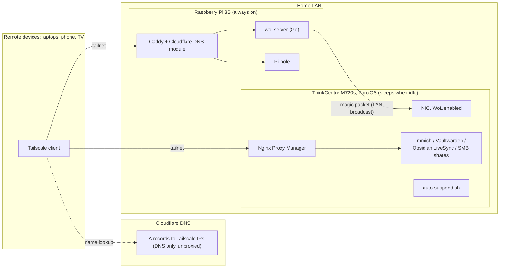

# andrlab — a private, power-aware home lab

A self-hosted "personal cloud" running on a refurbished Lenovo ThinkCentre M720s. It replaces commercial services for photos, passwords, notes, and file storage, and is designed around two constraints:

1. **Nothing is publicly exposed.** Every service is reachable only over my Tailscale tailnet, yet still served on clean subdomains with real, browser-trusted HTTPS.
2. **The server is not always on.** It suspends when idle and is woken on demand from anywhere through a small always-on Raspberry Pi that I built a Wake-on-LAN service for.

> Domain names, IP addresses, MAC addresses, and ports in this repo are placeholders (`mydomain.com`, `192.0.2.x`, etc.).

The reasoning behind the main choices is written up in [docs](docs/README.md).

---

## Highlights

- **Remote Wake-on-LAN service** — a small Go web service on a Raspberry Pi that sends a magic packet to the sleeping server, reachable from any device on the tailnet via `https://wake.mydomain.com`.
- **Private HTTPS without open ports** — wildcard Let's Encrypt certificates issued via Cloudflare DNS-01 challenges, with DNS records pointing at Tailscale IPs. Nothing listens on my public IP.
- **Two reverse proxies, each where it belongs** — Nginx Proxy Manager on the server, Caddy (custom build with the Cloudflare DNS module) on the Pi.
- **Network-wide ad blocking** with Pi-hole on the always-on Pi.
- **Idle-aware auto-suspend** *(in progress)* — a dependency-free POSIX shell script modelled on the check-based design of [autosuspend](https://github.com/languitar/autosuspend), calibrated against measured idle traffic.

---

## Architecture



**Why a separate always-on device?** A suspended machine can't run Tailscale, and Tailscale doesn't carry Layer-2 broadcasts, so a magic packet can't be sent to it directly from outside. Something awake *on the same LAN segment* has to send it. The Pi fills that role and also hosts DNS filtering, which is low-power work that benefits from being always available.

---

## Hardware

| Device | Role | Specs |
|---|---|---|
| Lenovo ThinkCentre M720s (SFF) | Main server | Intel Core i5-8400 (6C/6T), 32 GB DDR4, 500 GB NVMe SSD (OS + apps), 500 GB WD 2.5" HDD (data), Intel I219-V Gigabit Ethernet with WoL |
| Raspberry Pi 3B v1.2 | Always-on utility node | Raspberry Pi OS Lite 64-bit, wired Ethernet |

The M720s was chosen over a Pi-based NAS for its headroom (Immich's machine-learning features, future VMs), real SATA/NVMe storage instead of USB-attached drives, and Intel Quick Sync for media transcoding. At an estimated ~22 W average it costs roughly €55/year to run 24/7, which is part of why suspend-when-idle is worth doing.

---

## Services

| Service | Purpose | Host | Deployment |
|---|---|---|---|
| [Immich](https://immich.app) | Photo & video library (Google Photos replacement) | M720s | ZimaOS app store; library relocated to the data HDD |
| [Vaultwarden](https://github.com/dani-garcia/vaultwarden) | Password manager (Bitwarden-compatible) | M720s | ZimaOS app store, behind NPM with HTTPS |
| [Obsidian LiveSync](https://github.com/vrtmrz/obsidian-livesync) | Real-time Obsidian sync across desktop and mobile | M720s | ZimaOS app store ("Obsidian LiveSync", bundles CouchDB as its backend), one database per vault |
| SMB shares | Network file storage | M720s | ZimaOS built-in Samba, accessed over Tailscale |
| [Nginx Proxy Manager](https://nginxproxymanager.com) | Reverse proxy + TLS for server apps | M720s | ZimaOS app store |
| [Tailscale](https://tailscale.com) | Private network / remote access | Both | Container on ZimaOS, native package on the Pi |
| [Pi-hole](https://pi-hole.net) | Network-wide DNS filtering | Pi | Native install |
| [Caddy](https://caddyserver.com) | Reverse proxy + TLS for Pi services | Pi | Custom build with `caddy-dns/cloudflare`, systemd |
| **wol-server** | Remote Wake-on-LAN trigger | Pi | **Written by me** — Go, systemd ([`wol-server/`](wol-server/)) |
| **auto-suspend.sh** | Suspend server when idle | M720s | **Written by me** — POSIX sh, cron ([`scripts/`](scripts/)) |

Most server applications were installed through the ZimaOS app store rather than hand-written Compose files. My work on those was configuration and integration: storage layout, reverse proxying, certificates, access control, and making them work together with the sleep/wake design.

---

## Networking & security

### Principles

- **Private by default.** Services are reachable only from devices authenticated to my tailnet. No router port forwards exist for any of them.
- **Deliberate, per-port exposure only.** If something must be public later (e.g. a game server), only that single port/container gets exposed, never the host or dashboard.
- **Least-privilege secrets.** API tokens are scoped to the minimum needed and kept out of config files.

### Private HTTPS with a public domain

Vaultwarden's web vault refuses to run outside a secure context (browsers only expose the Web Crypto API over HTTPS or on `localhost`), so real HTTPS was a requirement, not a nicety. Self-signed certs would have meant installing a CA on every phone, laptop, and TV.

The solution:

1. The domain's DNS is managed in **Cloudflare**; the registrar stays separate.
2. Each service gets an **A record pointing at a Tailscale IP** (`100.x.y.z`), set to *DNS only*. The names resolve publicly, but the addresses are only routable inside the tailnet.
3. Certificates are issued by Let's Encrypt using the **DNS-01 challenge** through the Cloudflare API. Ownership is proven by creating a TXT record, so no inbound HTTP access is ever needed.
4. Cloudflare API tokens use the **"Edit zone DNS" template, scoped to this single zone**, limiting the blast radius if one leaks.

### Server side: Nginx Proxy Manager

- One **wildcard certificate** covering `*.mydomain.com` and `mydomain.com`, renewed automatically via DNS-01.
- A **proxy host per service** (`photos.`, `vault.`, …) with Force SSL and WebSocket support where needed.
- The bare domain serves the ZimaOS dashboard; **redirection hosts** with custom Nginx `return 301` rules give friendly shortcuts (e.g. `files.mydomain.com`) to specific dashboard modules.
- Tailscale runs as a container on ZimaOS, so TCP 80/443 on the server's tailnet address is forwarded to NPM.

### Pi side: Caddy

- The stock Caddy package has no DNS provider modules, so I installed a **custom build including `caddy-dns/cloudflare`** (ARM64), replacing the packaged binary while keeping its systemd unit.
- The Cloudflare token lives in `/etc/caddy/caddy.env` (mode `600`, root-only), loaded via a `systemctl edit` override with `EnvironmentFile=`. The Caddyfile only references `{env.CLOUDFLARE_API_TOKEN}`.
- Each Pi service is a short site block — see [`pi/Caddyfile.example`](pi/Caddyfile.example).

### Access

- SSH works on the LAN and remotely by connecting to the server's Tailscale IP with regular OpenSSH. Tailscale's own SSH feature is deliberately left disabled.
- Laptops mount SMB shares via `/etc/fstab` using `x-systemd.automount` and an idle timeout, so a sleeping server never hangs boot or the file manager. Credentials sit in a root-only file, not in `fstab`.

---

## Power management

### Wake-on-LAN

- WoL enabled in BIOS and confirmed at the OS level (`Wake-on: g`).
- Verified end-to-end from **full poweroff** and from **suspend-to-RAM** (`systemctl suspend`); waking from suspend is much faster than a cold boot.

### `wol-server` — remote wake service

The piece that makes sleeping practical. From any device on the tailnet, I open `https://wake.mydomain.com` and the server wakes within seconds.

- **Backend:** Go, standard library only (`net/http`, `os/exec`). Serves a static page and exposes `POST /wake`, which shells out to `wakeonlan` with the server's MAC. Non-POST requests return `405`; failures are logged and returned as `500` with the error text.
- **Frontend:** a single dependency-free HTML page that fires the request on load and shows live status (pending, success, or failure with details and a retry button). Bookmarkable on a phone home screen.
- **Build & deploy:** cross-compiled on my laptop (`GOOS=linux GOARCH=arm64`), copied to the Pi, run as a non-root **systemd service** with `After=network-online.target`, a fixed `WorkingDirectory` (static assets are resolved relatively), and `Restart=on-failure`.
- **Exposure:** listens only locally and is reached through Caddy over HTTPS on the tailnet. It's never publicly reachable.

### `auto-suspend.sh` — idle detection *(in progress)*

ZimaOS is a trimmed, appliance-style Linux without `apt` or the Python D-Bus bindings that [autosuspend](https://github.com/languitar/autosuspend) needs. Rather than bolting a second package manager onto the OS, I reimplemented autosuspend's architecture in plain POSIX `sh`:

- Each check is an independent function that returns *active* or *idle* and can be toggled on or off.
- **Any** active check resets the idle timer; the machine suspends only after **all** enabled checks have reported idle for the full window (1 hour).
- Runs from cron every 5 minutes, keeps state in a file, logs every decision.

| Check | Signal | Status |
|---|---|---|
| Load | 1-minute load average above threshold | Enabled |
| Users | Logged-in / SSH sessions | Enabled |
| NetworkBandwidth | RX+TX rate on the NIC above threshold | Enabled |
| Processes | Named finite jobs (backups, syncs) | Disabled by design |
| Ping | Another host being reachable | Disabled |

Two design decisions worth noting:

- **Calibrated, not guessed.** I measured the idle baseline from `/sys/class/net/<iface>/statistics` (~2.4 kB/s RX, ~9.6 kB/s TX) and set the bandwidth threshold at roughly 5× that, high enough to ignore Tailscale keepalives and health checks but low enough to catch someone browsing photos.
- **The process check is off on purpose.** Always-running services like Immich or Vaultwarden would make a process-name check report "active" forever, so the server would never sleep. Real usage of those services already shows up as load and network traffic. The process list is reserved for finite jobs like backups.

---

## DNS: Pi-hole

- Runs natively on the Pi with a DHCP reservation, used as the LAN's DNS server.
- Its web UI moved to an alternate port so Caddy could own 80/443, then published at `https://pihole.mydomain.com` with the same DNS-01 certificate flow.
- Set as the **tailnet-wide DNS server** in Tailscale (with "Override DNS servers" enabled), so my phone and laptops get ad blocking even away from home.
- Lives on the Pi rather than the server on purpose: if DNS sat on a machine that sleeps, the whole household's internet would break every night.

---

## Storage

- **NVMe SSD:** ZimaOS, apps, and databases.
- **HDD:** user data (Immich library, file shares). Immich's upload location was moved to the HDD following the [official custom-locations guide](https://docs.immich.app/guides/custom-locations/).
- **RAID 1 is deferred.** The original second drive turned out to be failing (reported 0 B capacity, wouldn't format). Rather than mirroring with a mismatched SSD, I run a single data drive for now and will add a matched mirror later. Until then, backups are the priority (see roadmap).

---

## Problems I ran into (and what I learned)

| Problem | Root cause | Fix |
|---|---|---|
| Vaultwarden web vault refused to load over `http://<lan-ip>` | Web Crypto API requires a secure context | Drove the whole HTTPS design: domain + DNS-01 + reverse proxy |
| Tailscale SSH: `failed to look up local user` for my account | Tailscale SSH looks up real Linux users, but the ZimaOS account is an app-layer dashboard user, not an entry in `/etc/passwd` | Disabled Tailscale SSH and use regular OpenSSH over the server's Tailscale IP |
| HDD showed `0 B` capacity and failed to format during RAID setup | Failing drive, confirmed with `lsblk` / SMART from the shell | Deferred RAID 1; single data drive for now |
| Immich crash-looped after changing the upload path | Expected folder structure and ownership weren't created on the new mount | Clean reinstall pointed at the new path from the start (no data yet) |
| Pi-hole web UI conflicted with Caddy | Both wanted port 80 | Moved Pi-hole's UI to another port, proxied through Caddy |
| Subdomain kept loading over HTTP after fixing redirects | Browser cached an old redirect response | Hard refresh; test redirect changes in a private window |
| Worry that an uptime monitor would keep the server awake | Polling can't *wake* a sleeping host (only a magic packet can), but it could look like activity | Run monitoring from the Pi and keep idle checks based on load/bandwidth thresholds rather than any connection |

---

## Roadmap

- [x] ZimaOS install, DHCP reservation, SSH (LAN + Tailscale)
- [x] Immich, Vaultwarden, Obsidian LiveSync
- [x] Custom domain with private wildcard HTTPS (Cloudflare DNS-01 + NPM)
- [x] Raspberry Pi: Pi-hole, Caddy, Wake-on-LAN service
- [x] Wake-on-LAN verified from poweroff and suspend
- [x] Pi-hole as the tailnet's DNS server, so filtering also works away from home
- [ ] Deploy `auto-suspend.sh` via cron after final calibration
- [ ] Backups for irreplaceable data (photos, vault) following 3-2-1
- [ ] RAID 1 with a matched second drive
- [ ] Uptime Kuma on the Pi
- [ ] Jellyfin/Plex, copyparty, music streaming
- [ ] Game server exposed on a single forwarded port

---

## Repository layout

```
.
├── README.md
├── wol-server/            # Go Wake-on-LAN service + systemd unit
├── scripts/
│   └── auto-suspend.sh    # idle detection and suspend
├── pi/
│   └── Caddyfile.example  # Caddy config with placeholder domains
└── docs/
    └── decisions/         # short write-ups of key design choices
```

---

## References

Built primarily from official documentation:
[Tailscale](https://tailscale.com/kb) ·
[Caddy](https://caddyserver.com/docs/) ·
[Nginx Proxy Manager](https://nginxproxymanager.com/guide/) ·
[Pi-hole](https://docs.pi-hole.net) ·
[Immich](https://docs.immich.app) ·
[Vaultwarden wiki](https://github.com/dani-garcia/vaultwarden/wiki) ·
[Cloudflare API tokens](https://developers.cloudflare.com/fundamentals/api/get-started/create-token/) ·
[ZimaOS](https://www.zimaspace.com/docs/zimaos/) ·
[autosuspend](https://autosuspend.readthedocs.io)
